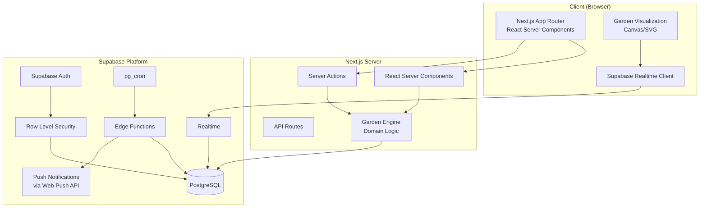
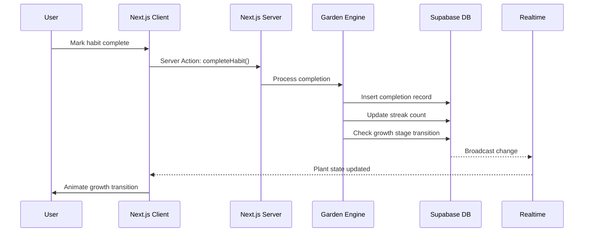
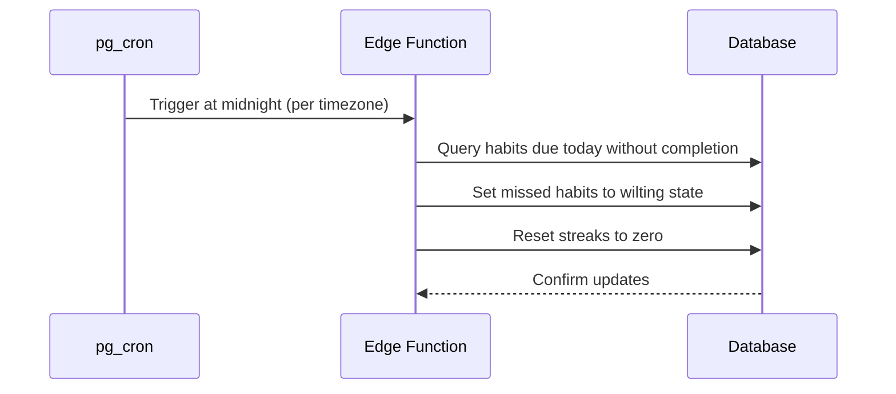
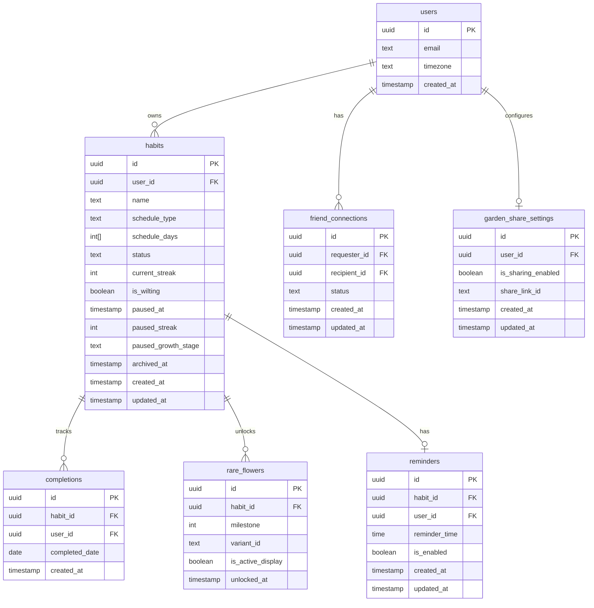

# Design Document: GrowthGarden

## Overview

GrowthGarden is a habit-tracking application that visualizes user habits as a living garden. The system is built on Next.js (App Router) for the frontend and API layer, with Supabase providing authentication, PostgreSQL database, real-time subscriptions, and push notifications infrastructure.

The core domain logic revolves around the "Garden Engine" — a set of server-side functions that compute plant states based on habit completion data, enforce streak rules, manage growth stage transitions, and handle wilting mechanics. The visualization layer renders plants in distinct growth stages within an interactive garden grid.

Key architectural decisions:
- **Server Components + Server Actions**: Next.js App Router with React Server Components for data fetching and Server Actions for mutations, minimizing client-side state
- **Supabase Auth**: Leveraging Supabase's built-in authentication for user management, session handling, and Row Level Security (RLS)
- **PostgreSQL computed state**: Plant growth stages are computed from streak data rather than stored as independent mutable state, ensuring consistency
- **Edge Functions for scheduled tasks**: Supabase Edge Functions handle wilting evaluation and reminder delivery via pg_cron triggers

## Architecture

### System Architecture Diagram



### Data Flow



### Scheduled Wilting Flow



## Components and Interfaces

### Frontend Components

| Component | Responsibility | Route |
|-----------|---------------|-------|
| `AuthForm` | Registration and login forms with validation | `/login`, `/register` |
| `GardenGrid` | Renders the garden grid with all active plants | `/garden` |
| `PlantCard` | Individual plant with growth stage visualization | Used within `GardenGrid` |
| `HabitForm` | Create/edit habit form with schedule picker | `/habits/new`, `/habits/[id]/edit` |
| `HabitList` | Lists habits with completion toggles | `/habits` |
| `Dashboard` | Statistics overview and progress metrics | `/dashboard` |
| `FriendsList` | Friend connections and pending requests | `/friends` |
| `VisitorGarden` | Read-only garden view for visitors | `/garden/visit/[shareId]` |
| `RareFlowerSelector` | Variant picker for plants with unlocked flowers | Modal within `PlantCard` |
| `ReminderSettings` | Per-habit reminder time configuration | Within habit edit |

### Server Actions (Mutations)

```typescript
// Authentication
async function register(formData: FormData): Promise<AuthResult>
async function login(formData: FormData): Promise<AuthResult>
async function logout(): Promise<void>

// Habits
async function createHabit(data: CreateHabitInput): Promise<Habit>
async function updateHabit(id: string, data: UpdateHabitInput): Promise<Habit>
async function pauseHabit(id: string): Promise<Habit>
async function resumeHabit(id: string): Promise<Habit>
async function archiveHabit(id: string): Promise<Habit>
async function restoreHabit(id: string): Promise<Habit>

// Completions
async function completeHabit(habitId: string, date: string): Promise<Completion>

// Social
async function toggleGardenSharing(enabled: boolean): Promise<ShareSettings>
async function sendFriendRequest(email: string): Promise<FriendRequest>
async function acceptFriendRequest(requestId: string): Promise<FriendConnection>
async function rejectFriendRequest(requestId: string): Promise<void>
async function removeFriend(friendId: string): Promise<void>

// Rare Flowers
async function selectFlowerVariant(plantId: string, variantId: string): Promise<void>

// Reminders
async function setReminder(habitId: string, time: string | null): Promise<void>
```

### Garden Engine (Domain Logic)

```typescript
// Core computation functions
function computeGrowthStage(streak: number, isWilting: boolean): GrowthStage
function shouldWilt(habit: Habit, completions: Completion[], today: Date): boolean
function checkRareFlowerUnlock(streak: number, existingUnlocks: RareFlower[]): RareFlower | null
function isScheduledDay(habit: Habit, date: Date): boolean
function calculateWeeklyCompletionRate(habits: Habit[], completions: Completion[], today: Date): number
```

### API Routes (Public endpoints)

| Method | Path | Purpose |
|--------|------|---------|
| GET | `/api/garden/[shareId]` | Public garden view for visitors |

### Supabase Edge Functions

| Function | Trigger | Purpose |
|----------|---------|---------|
| `evaluate-wilting` | pg_cron (hourly) | Check for missed completions and apply wilting |
| `send-reminders` | pg_cron (every minute) | Send push notifications for due reminders |

## Data Models

### Entity Relationship Diagram



### Table Definitions

#### `profiles` (extends Supabase auth.users)

| Column | Type | Constraints | Description |
|--------|------|-------------|-------------|
| id | uuid | PK, FK to auth.users | User identifier |
| timezone | text | NOT NULL, DEFAULT 'UTC' | User's local timezone (IANA format) |
| created_at | timestamptz | NOT NULL, DEFAULT now() | Account creation time |

#### `habits`

| Column | Type | Constraints | Description |
|--------|------|-------------|-------------|
| id | uuid | PK, DEFAULT gen_random_uuid() | Habit identifier |
| user_id | uuid | FK to profiles.id, NOT NULL | Owner |
| name | text | NOT NULL, CHECK length 1-50 | Habit name |
| schedule_type | text | NOT NULL, CHECK IN ('daily','weekly','custom') | Schedule type |
| schedule_days | int[] | nullable | Days of week (0=Sun, 6=Sat) for weekly/custom |
| status | text | NOT NULL, DEFAULT 'active', CHECK IN ('active','paused','archived') | Habit status |
| current_streak | int | NOT NULL, DEFAULT 0 | Current consecutive completions |
| is_wilting | boolean | NOT NULL, DEFAULT false | Whether plant is in wilting state |
| paused_at | timestamptz | nullable | When the habit was paused |
| paused_streak | int | nullable | Streak value at time of pause |
| paused_growth_stage | text | nullable | Growth stage at time of pause |
| archived_at | timestamptz | nullable | When the habit was archived |
| created_at | timestamptz | NOT NULL, DEFAULT now() | Creation time |
| updated_at | timestamptz | NOT NULL, DEFAULT now() | Last update time |

#### `completions`

| Column | Type | Constraints | Description |
|--------|------|-------------|-------------|
| id | uuid | PK, DEFAULT gen_random_uuid() | Completion identifier |
| habit_id | uuid | FK to habits.id, NOT NULL | Associated habit |
| user_id | uuid | FK to profiles.id, NOT NULL | User who completed |
| completed_date | date | NOT NULL | The date of completion |
| created_at | timestamptz | NOT NULL, DEFAULT now() | Record creation time |

**Unique constraint**: `(habit_id, completed_date)` — prevents duplicate completions.

#### `rare_flowers`

| Column | Type | Constraints | Description |
|--------|------|-------------|-------------|
| id | uuid | PK, DEFAULT gen_random_uuid() | Flower identifier |
| habit_id | uuid | FK to habits.id, NOT NULL | Associated habit |
| milestone | int | NOT NULL, CHECK IN (30, 60, 100) | Streak milestone that unlocked it |
| variant_id | text | NOT NULL | Visual variant identifier |
| is_active_display | boolean | NOT NULL, DEFAULT false | Currently displayed variant |
| unlocked_at | timestamptz | NOT NULL, DEFAULT now() | When unlocked |

**Unique constraint**: `(habit_id, milestone)` — prevents duplicate unlocks.

#### `garden_share_settings`

| Column | Type | Constraints | Description |
|--------|------|-------------|-------------|
| id | uuid | PK, DEFAULT gen_random_uuid() | Setting identifier |
| user_id | uuid | FK to profiles.id, UNIQUE, NOT NULL | Owner |
| is_sharing_enabled | boolean | NOT NULL, DEFAULT false | Sharing toggle |
| share_link_id | text | UNIQUE, nullable | Current active share link |
| created_at | timestamptz | NOT NULL, DEFAULT now() | Creation time |
| updated_at | timestamptz | NOT NULL, DEFAULT now() | Last update time |

#### `friend_connections`

| Column | Type | Constraints | Description |
|--------|------|-------------|-------------|
| id | uuid | PK, DEFAULT gen_random_uuid() | Connection identifier |
| requester_id | uuid | FK to profiles.id, NOT NULL | User who sent request |
| recipient_id | uuid | FK to profiles.id, NOT NULL | User who received request |
| status | text | NOT NULL, DEFAULT 'pending', CHECK IN ('pending','accepted','rejected') | Connection status |
| created_at | timestamptz | NOT NULL, DEFAULT now() | Request time |
| updated_at | timestamptz | NOT NULL, DEFAULT now() | Last update time |

**Unique constraint**: `(requester_id, recipient_id)` — prevents duplicate requests.

#### `reminders`

| Column | Type | Constraints | Description |
|--------|------|-------------|-------------|
| id | uuid | PK, DEFAULT gen_random_uuid() | Reminder identifier |
| habit_id | uuid | FK to habits.id, UNIQUE, NOT NULL | Associated habit |
| user_id | uuid | FK to profiles.id, NOT NULL | Owner |
| reminder_time | time | NOT NULL, DEFAULT '09:00' | Time to send reminder |
| is_enabled | boolean | NOT NULL, DEFAULT true | Whether reminder is active |
| retry_count | int | NOT NULL, DEFAULT 0 | Current retry count |
| last_sent_at | timestamptz | nullable | Last successful delivery |
| created_at | timestamptz | NOT NULL, DEFAULT now() | Creation time |
| updated_at | timestamptz | NOT NULL, DEFAULT now() | Last update time |

### Row Level Security Policies

```sql
-- profiles: users can only read/update their own profile
CREATE POLICY "Users can read own profile" ON profiles FOR SELECT USING (auth.uid() = id);
CREATE POLICY "Users can update own profile" ON profiles FOR UPDATE USING (auth.uid() = id);

-- habits: users can CRUD their own habits
CREATE POLICY "Users can manage own habits" ON habits FOR ALL USING (auth.uid() = user_id);

-- completions: users can insert/read their own completions
CREATE POLICY "Users can manage own completions" ON completions FOR ALL USING (auth.uid() = user_id);

-- rare_flowers: users can read their own, visitors can see via share link (handled in API)
CREATE POLICY "Users can read own flowers" ON rare_flowers FOR SELECT USING (
  auth.uid() = (SELECT user_id FROM habits WHERE id = habit_id)
);

-- garden_share_settings: users manage their own settings
CREATE POLICY "Users can manage own share settings" ON garden_share_settings FOR ALL USING (auth.uid() = user_id);

-- friend_connections: users can see connections they're part of
CREATE POLICY "Users can see own connections" ON friend_connections FOR SELECT USING (
  auth.uid() = requester_id OR auth.uid() = recipient_id
);
```

### Growth Stage Computation Logic

Growth stage is derived from streak and wilting state:

```typescript
type GrowthStage = 'seed' | 'sprout' | 'budding' | 'blooming' | 'wilting';

function computeGrowthStage(streak: number, isWilting: boolean): GrowthStage {
  if (isWilting) return 'wilting';
  if (streak >= 21) return 'blooming';
  if (streak >= 7) return 'budding';
  if (streak >= 3) return 'sprout';
  return 'seed';
}
```

## Correctness Properties

*A property is a characteristic or behavior that should hold true across all valid executions of a system — essentially, a formal statement about what the system should do. Properties serve as the bridge between human-readable specifications and machine-verifiable correctness guarantees.*

### Property 1: Growth stage computation is deterministic and threshold-based

*For any* non-negative streak value and wilting state, `computeGrowthStage(streak, isWilting)` SHALL return:
- `'wilting'` if isWilting is true (regardless of streak)
- `'blooming'` if streak >= 21 and not wilting
- `'budding'` if 7 <= streak < 21 and not wilting
- `'sprout'` if 3 <= streak < 7 and not wilting
- `'seed'` if streak < 3 and not wilting

**Validates: Requirements 3.2, 4.1, 4.2, 4.3, 4.4, 4.5, 4.6**

### Property 2: Habit name and schedule validation rejects invalid inputs

*For any* string that is empty, composed entirely of whitespace, or exceeds 50 characters, the habit validation function SHALL reject it. *For any* string between 1-50 characters with at least one non-whitespace character paired with a valid schedule, the validation SHALL accept it.

**Validates: Requirements 2.1, 2.3, 10.6**

### Property 3: Auth credential validation

*For any* string, the password validation function SHALL accept it if and only if its length is between 8 and 128 characters inclusive. *For any* string, the email validation function SHALL accept it if and only if it contains a local part, an @ symbol, and a domain with at least one dot.

**Validates: Requirements 1.4, 1.6, 1.7**

### Property 4: Completion uniqueness per habit per day

*For any* habit and scheduled date, if a completion already exists for that habit on that date, attempting to record another completion SHALL be rejected without modifying any state.

**Validates: Requirements 3.3, 3.4**

### Property 5: Completions only on scheduled days

*For any* habit with a defined schedule and *for any* date that is NOT part of that schedule, attempting to record a completion SHALL be rejected. Conversely, *for any* date that IS part of the schedule, the completion SHALL be accepted (assuming no duplicate exists).

**Validates: Requirements 3.5, 5.6**

### Property 6: Wilting transition resets streak and sets wilting state

*For any* active habit (regardless of current growth stage or streak value), when a scheduled day passes without a completion, the habit's `is_wilting` SHALL become true AND `current_streak` SHALL become 0.

**Validates: Requirements 5.1, 5.2**

### Property 7: Wilting recovery starts fresh at seed with streak 1

*For any* habit in the wilting state, recording a completion SHALL set `is_wilting` to false, `current_streak` to 1, and `computeGrowthStage(1, false)` SHALL return `'seed'`.

**Validates: Requirements 5.3**

### Property 8: Wilting evaluation is idempotent and schedule-aware

*For any* habit already in the wilting state, evaluating wilting again (on subsequent missed days) SHALL not change the habit's state. *For any* habit with a non-daily schedule, wilting evaluation on a non-scheduled day SHALL not change the habit's state.

**Validates: Requirements 5.5, 5.6**

### Property 9: Rare flower unlock at milestones without duplication

*For any* habit and streak value, `checkRareFlowerUnlock(streak, existingUnlocks)` SHALL return a new unlock if and only if the streak equals a milestone (30, 60, or 100) AND no unlock exists for that milestone. If an unlock already exists at that milestone, the function SHALL return null.

**Validates: Requirements 6.1, 6.2, 6.3, 6.6**

### Property 10: Rare flowers are permanently retained

*For any* habit with unlocked rare flowers, performing a streak reset, pause, archive, or restore operation SHALL NOT remove or modify any existing rare flower records.

**Validates: Requirements 6.4**

### Property 11: Share link uniqueness and invalidation

*For any* user generating a share link, the generated link SHALL be unique across all existing and previously generated links. *For any* user who disables and re-enables sharing, the new link SHALL differ from the previously generated link.

**Validates: Requirements 8.1, 8.6**

### Property 12: Visitor view data filtering

*For any* garden state viewed through the visitor endpoint, the response SHALL contain plant growth stages and unlocked rare flower variants, and SHALL NOT contain streak counts or completion history records.

**Validates: Requirements 8.3**

### Property 13: Friend connection symmetry

*For any* accepted friend connection between user A and user B, both users SHALL appear in each other's friends list. *For any* removed friend connection, neither user SHALL appear in the other's friends list.

**Validates: Requirements 9.2, 9.5**

### Property 14: Friend garden visibility requires both connection and sharing

*For any* pair of users, a user's garden SHALL be visible to the other user if and only if (1) a mutual accepted friend connection exists AND (2) the garden owner has sharing enabled. If either condition is false, the garden SHALL NOT be visible.

**Validates: Requirements 9.3**

### Property 15: Habit edit preserves streak and growth stage

*For any* active habit with a current streak and growth stage, editing the habit's name or schedule SHALL preserve the exact same streak value and growth stage.

**Validates: Requirements 10.1**

### Property 16: Pause/resume round trip preserves state

*For any* active habit with a given streak and growth stage, pausing and then resuming the habit SHALL restore the exact same streak and growth stage values. While paused, the habit SHALL be excluded from wilting evaluation.

**Validates: Requirements 10.2, 10.3**

### Property 17: Archive preserves data, restore resets streak to zero

*For any* habit that is archived, all completion history and rare flowers SHALL be preserved. *For any* archived habit that is restored, the growth stage SHALL match the value at archival time, and the streak SHALL be reset to zero.

**Validates: Requirements 10.4, 10.5**

### Property 18: Reminder suppression when completion exists

*For any* habit with a reminder enabled, if a completion has been recorded for the current scheduled day, the reminder SHALL be suppressed (not sent).

**Validates: Requirements 11.3**

### Property 19: Weekly completion rate calculation

*For any* set of active (non-paused, non-archived) habits with defined schedules, the weekly completion rate SHALL equal (total completions in the rolling past 7 days) divided by (total scheduled occurrences in the rolling past 7 days), expressed as a whole-number percentage between 0 and 100.

**Validates: Requirements 12.2**

### Property 20: Dashboard statistics computation

*For any* set of user habits (active, paused, and archived) with their completions and rare flowers, the dashboard SHALL correctly compute: total active habits count (excluding paused and archived), the longest current streak among active habits, total lifetime completions (including archived), and total rare flowers unlocked (including archived).

**Validates: Requirements 12.1, 12.4**

## Error Handling

### Client-Side Errors

| Error Type | Handling Strategy |
|-----------|-------------------|
| Form validation failure | Display inline error messages next to invalid fields. Prevent submission. |
| Network timeout | Show toast notification with retry option. Preserve form state. |
| Session expired | Redirect to login with a message. Preserve intended destination for post-login redirect. |
| Rate limiting (429) | Display "Please wait" message with countdown timer. |

### Server-Side Errors

| Error Type | Handling Strategy |
|-----------|-------------------|
| Database constraint violation (duplicate completion) | Return structured error with code `DUPLICATE_COMPLETION` and user-friendly message. |
| Habit limit exceeded | Return error code `HABIT_LIMIT_REACHED` with current count. |
| Invalid share link | Return 404 with generic "garden not available" message. Never reveal if garden exists. |
| Friend request to non-existent user | Return error code `USER_NOT_FOUND`. Do not reveal which emails are registered (use generic message). |
| Edge Function failure (wilting/reminders) | Log to Supabase dashboard. Retry on next cron interval. Alert on 3+ consecutive failures. |

### Graceful Degradation

- If Realtime subscription fails, fall back to polling every 30 seconds
- If push notification delivery fails, implement retry logic (max 2 retries at 15-min intervals, abandon after 60 minutes past scheduled time)
- If dashboard stats query times out, show cached values with "last updated" timestamp and retry button

### Data Consistency

- Use database transactions for operations that span multiple tables (e.g., completion + streak update + growth stage check + rare flower unlock)
- Use optimistic locking via `updated_at` timestamps for concurrent edit detection
- Edge Function wilting evaluation uses row-level locks to prevent race conditions with user completions

## Testing Strategy

### Testing Framework

- **Unit Tests**: Vitest (integrated with Next.js)
- **Property-Based Tests**: fast-check (TypeScript PBT library) with Vitest
- **Integration Tests**: Vitest + Supabase local dev (via `supabase start`)
- **E2E Tests**: Playwright for critical user flows

### Property-Based Testing Configuration

Each property-based test must:
- Run a minimum of **100 iterations** per property
- Reference the design property via tag comment
- Tag format: `Feature: growth-garden, Property {number}: {property_text}`

Library: [fast-check](https://github.com/dubzzz/fast-check) — the standard PBT library for TypeScript/JavaScript.

### Test Breakdown

| Test Type | Scope | Coverage |
|-----------|-------|----------|
| Property tests | Garden Engine pure functions (computeGrowthStage, isScheduledDay, checkRareFlowerUnlock, calculateWeeklyCompletionRate, validation functions) | Properties 1-20 |
| Unit tests (example-based) | Edge cases, error conditions, specific scenarios (empty state, duplicate detection, schedule type creation) | AC 1.3, 1.5, 2.2, 2.4, 2.5, 6.5, 6.7, 7.1-7.5, 8.2, 8.4, 8.5, 8.7, 9.1, 9.4, 9.6, 9.7, 11.2, 11.4, 11.5, 11.7, 12.5, 12.6 |
| Integration tests | Supabase Auth flows, RLS policies, Edge Function triggers, Realtime subscriptions, notification delivery | AC 1.1, 1.2, 1.8, 3.6, 5.4, 7.3, 8.2, 11.1, 11.6, 12.3 |
| E2E tests | Full user journeys (register → create habit → complete → see growth → share garden) | Critical paths across requirements |

### Unit Test Focus Areas

- **Validation functions**: Email format, password length, habit name constraints
- **Schedule logic**: isScheduledDay for daily/weekly/custom configurations
- **Empty states**: Dashboard with no data, garden with no habits
- **Error responses**: Appropriate error codes and messages for each failure mode

### Property Test Focus Areas

- **computeGrowthStage**: Threshold correctness across full integer range
- **Streak mechanics**: Increment, reset, wilting transitions
- **Rare flower unlock**: Milestone detection, idempotence, persistence
- **Weekly rate calculation**: Correct percentage for varied schedule/completion combinations
- **Data filtering**: Visitor view never leaks private data
- **Pause/resume/archive round trips**: State preservation guarantees
- **Friend visibility**: Correct conjunction of connection + sharing conditions

